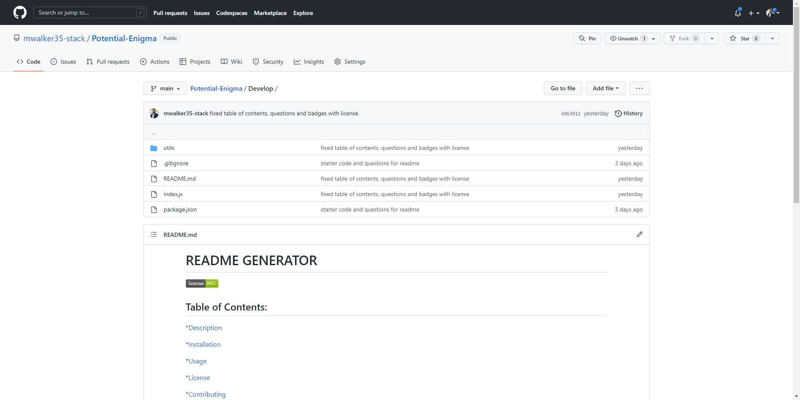

# ReadMe Generator
  
  ## Table of Contents:
  *[Description](#Description)

  *[Installation](#Installation)

  *[Usage](#Usage)

  *[License](#License)

  *[Contributing](#Contributing)

  *[Tests](#Tests)

  *[Questions](#Questions)

  ## Description: 
  Create a professional readme 

  ## Installation:
  inquirer

  ## Usage:
  in the terminal

  ## License:
  
   
  This application is covered by the MIT license. 

  ## Contributing:
  N/a

  ## Questions:
  If you have questions please Email: mwalke35@yahoo.com 
  See: GitHub:  (https://github.com/mwalker35-stack)

  ## Video: 
  https://watch.screencastify.com/v/EvHcPotvBZbosFqkqCuF

  ## GitHub Link:
  https://github.com/mwalker35-stack/Potential-Enigma/tree/main/Develop#Contributing

  
